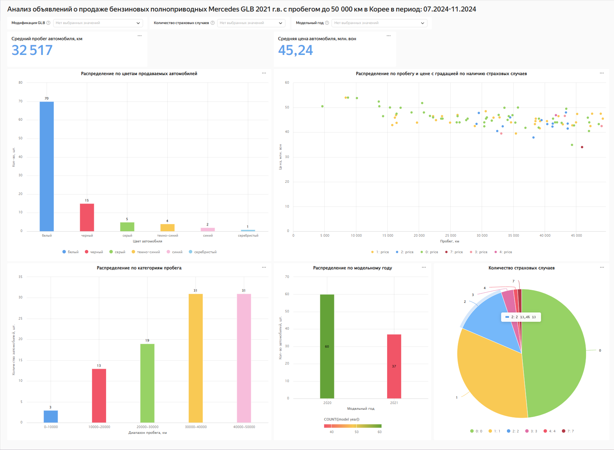

# Анализ объявлений о продаже бензиновых полноприводных Mercedes-Benz GLB 2021 г.в. с пробегом до 50 000 км в Корее, в период: 07.2024-11.2024.  

## Описание задачи
В данном проекте выполняется анализ объявлений о продаже автомобилей модели Mersedes-Benz GLB с бензиновыми моторами и полным приводом, которые были выставлены на продажу в Южной Корее в 
период с июля 2024 по ноябрь 2024. Данные собирались с интернет ресурсов encar.com и kbchachacha.com. Это крупнейшие интернет-площадки по продаже автомобилей в Южной Корее. Автомобили, 
рассматриваемые в данном проекте, брались исключительно "проходных" готов выпуска (2020, 2021) и с небольшим пробегом до 50000 км.  
Южная Корея была выбрана в качестве страны-объекта для проведения данного анализа по причине того, что в 2024 году является, пожалуй, самым популярным направлением по параллельному импорту
б/у автомобилей премиальных немецких марок.  
В файле представлены 2 модификации автомобилей Mersedes-Benz GLB (GLB 250 и GLB 35) т.к. в Корее в качестве удовлетворяющих нашим условиям (бензин, полный привод) встречаются именно они.  
В идеале нам нужно рассмотреть автомобили только 2021 года выпуска как наиболее "свежие" и при этом "проходные" по таможенным пошлинам. Однако объявления о продаже автомобилей в Корее
имеют следующую особенность - в качестве года выпуска продавец указывает месяц и год первичной регистрации автомобиля. Соответственно, в выборку попали автомобили с реальным годом выпуска как 2021,
так и 2020. В ходе выполнения анализа была добавлена колонка 'модельный год', где как раз указывается реальный год выпуска автомобиля, вычисленный по имеющимся в нашей таблице исходным данным.
Сами по себе года 2020/2021 отличаются минимально в плане комплектации. В 2021 г. она чуть лучше. Внутри одного модельного года(года выпуска) все автомобили имеют практически идентичные комплектации.
Это особенность рынка Южной Кореи по данной модели.

## Реализация
На входе у нас имеется XLS-файл с "грязными" данными по рассматрваемым объялениям о продаже. Данный файл мы загружаем в jupyter-ноутбук, удаляем лишние колонки и строки, выполняем преобразование 
форматов данных, где это необходимо, заполняем пустые/неопределенные значения, добавляем дополнительные категориальные поля, вычисленные на основе имеющихся. Вычисляем с помощью pandas
некоторые интересующие нас метрики ( средняя цена, средний пробег, средняя выплата по страховому случаю, зависимости от модификации и наличия страховых случаев и т.д.), строим графики с помощью 
библиотеки seaborn.
Далее выгружаем только необходимые для дальнейшего построения дашборда колонки в CSV-файл, который импортируем в облачную версию BI-системы Datalens. После чего строим дашборд с виджетами и фильтрацией
по модификациям, году выпуска, наличю страховых случаев.
Дашборд можно посмотреть по ссылке:
https://datalens.yandex/9p0bcg2c44ekw

## Технологический стек:
Python, pandas, numpy, seaborn, matplotlib, Datalens  

## Структура исходных данных:
№:  Порядковый номер записи   
модель:  модификация автомобиля (GLB 250 или GLB 35).   
регистрация:  дата первичной регистрации автомобиля    
vin:  последние 5-6 цифр vin номера автомобиля.    
выпуск:  год выпуска автомобиля   
пробег:  пробег автомобиля.    
цена:  цена автомобиля в Южной Корее, в млн. вон   
Кол-во страховых случаев:  количество страховых случаев у автомобиля.   
Выплаты этому авто:  суммарные выплаты данному автомобилю по страховым случаям при их наличии.   
Выплаты другому:  суммарные выплаты другим участникам страховых случаев, при их наличии.   
Комплектация:  особенности комплектации.   
Цвет:  цвет автомобиля.   
комментарии:  комментарии в свободной форме.    

## Файлы и папки в репозитории:
MB_GLB_sales_Korea.ipynb - ноутбук, выполняющий очистку, обработку, выгрузку данных.  
GLB_kor.xlsx - файл с исходными данными.  
GLB.csv  - файл с выгруженными обработанными данными, загружаемый в BI-систему.   

